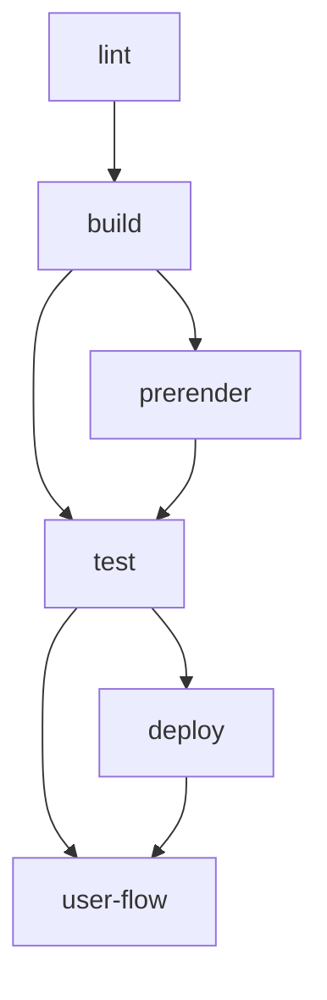
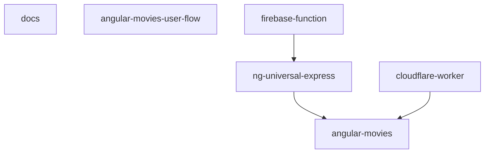

# angular-movies

  

    <a href="https://github.com/pripramot/i-studio">
      

    </a>
  

  <h4 align="center">
    <a href="https://mtify.hashnode.dev/">Get Started</a> |
    <a href="https://github.com/ai-jiraphinya/ai-jiraphinya/wiki">Docs</a> |
    <a href="https://nuxt-movies.vercel.app">By TMDB</a>
  </h4>

<h3 align="center"> NO General-ฉันอ่านของฉันรู้เรื่อง!แจ่มจัง ภาพยนต์</h3>

  
  
  
  

 

## เปิดด้วย desktop,เปิดด้วยมือถือ,คุณจะเห็น README.md ต่างกัน

<!-- กุญเเจตัวอย่าง -->

| example                                                                               | describe          |
| ----------------------------------------------------------------------------------- | ------------- |
| hlsp2p.xyz/play/ef0817b0-9008-5229-a7e6-21dd94ad6d4e                                | พระอัครมเหสีใน สมเด็จพระมหาจักรพรรดิ 5 ชั่วโมง   |
| streamhls.com/play/06977bf1-527d-5918-abe4-25505e94dc91                               | full hd ซับไทย       |
| play.kakjeawplay.xyz/embed/ugut2bi8xp                                                                         | พระเอกปลุกจิตได้       |
| play.kakjeawplay.xyz/embed/8d75pma835                                                                   | พระเอกยืนบนหลังปลา ภาค 2 |
| play.kakjeawplay.xyz/embed/nwbhpvuyux                                                                              | คอลเซ็นเตอร์ไม่ดี ฆ่าผึ้งข้า ภาพ sd         |
| play.kakjeawplay.xyz/embed/sch64mvgkf                      | อนิเมะ      |
|                      |        |
|                                                                        |       |
|  |       |
|                                                                           |        |
 

<!-- กุญเเจตัวอย่าง -->

## Commits,

### Hooks,กัปตันเเขนเดียว

ในการตั้งค่า commit hooks ให้เรียกใช้ `npm run prepare`.

### ให้สัญญาที่ไม่ใช่-สัญญาเมื่อสายัณห์.

Commit lint is used to enforce the standard. The repositories commit message standard is defined
in `commit-lint.config.json`.

### Commit hooks

- commit-msg - executes `commitlint`
- pre-commit - executes `lint-staged`

## Task Hierarchy

## ลําดับชั้นของแอป.desktop-มือถือ.คุณจะเห็นสิ่งนี้ไม่เหมือนกัน

The repository maintains the following projects:พื้นที่เก็บข้อมูลรักษาโครงการต่อไปนี้:

- angular-movies - แอปพลิเคชั่นเชิงมุมที่ให้บริการในเว็บเบราว์เซอร์
- ng-universal-express - เซิร์ฟเวอร์โหนดด่วนที่ใช้สําหรับ SSR และ SSG angular-movies `@nguniversal`
- firebase-function - ฟังก์ชัน firebase ที่ใช้ในการเรียกใช้ SSR ของ ng-universal-express ในฟังก์ชัน firebase
- cloudflare-worker - ผู้ปฏิบัติงาน cloudflare ที่ใช้ในการเรียกใช้ SSR ของแอปภาพยนตร์เชิงมุมในผู้ปฏิบัติงาน
  

## Project Types

We consider the following types a archetypal project:

- Browser Application - maintaining an application served in the web e.g. Angular
- Angular Universal Express Application - maintaining a node express server for Angular and the related projects
- Firebase Function Application - maintaining a node function hosted on firebase cloud functions

# Tags

- docs - ["scope:shared", "type:util"]
- movies-user-flow - ["scope:shared", "type:util"]
- angular-movies - ["scope:client", "type:app"]
- ng-universal-express - ["scope:server", "type:app"]
- firebase-function - ["scope:server", "type:app"]
- cloudflare-worker - ["scope:server", "type:app"]

## Global Project Targets (`nx.json`)

In this mono repository we agree on a set of tasks that need to be consistent across the platforms:

### Tasks (`nx.json#targetDefaults`)

- **format** - defined in `prettierrc.json`
- **lint** - global linting
- **build** - build project for different reason
  - **development** - environments fast to build and easy to debug. No bundle budgets.
  - **production** - final build and. Bundle budgets used.
- **prerender** - prerender static pages of `movies` project for `deploy-hodting-*` tasks
- **serve** - serves for development and production build in a self hosted (emulated) environment
- **test** - project related tests (unit, integration) with optional postfix (if postfix is needed use `test-*`)
- **e2e** - e2e tests with optional postfix (if postfix is needed use `e2e-*`)
- **emulate** - emulated environments with optional postfix (if postfix is needed use `emulate-*`)
- **deploy** - deployment targets with optional postfix (if postfix is needed use `deploy-*`)
- **user-flow** - e2e tests inc lighthouse measures
  - **development** - environments fast to start and easy to debug. No perf measures.
  - **production** - environments close to the released version

### Caching Strategies (`nx.json#"tasksRunnerOptions#default#options#cacheableOperations`)

`nx` is used for local caching, `nx-cloud` for distributed caching.

The cacheableOperations are:

- lint
- build
- test
- prerender - only static pages are pre-rendered therefor we can cache it

# Projects (`nx.json#layout`)

## Docs

### Tasks

- **format** - Markdown specific formatting
- **lint** - adds `plugin:markdownlint/recommended`
- **build-report** - `state.json` and bundle analyzer generation
- **update-readme** - update the main readme (`./README.md`) with data from our builds and reports

## Browser Application

The browser application is needed to run host a CRS version of the application as well as all static files e.g.
pre-rendered pages or `routes.txt`

### Tasks

- **format** - base formatting
- **lint** - adds `@angular-eslint`, `@rx-angular/eslint-plugin`
- **build** - the executor `browser` from the package `@angular-devkit/build-angular` is used
  - **production**
  - **development**
- **serve** - the executor `dev-server` from the package `@angular-devkit/build-angular` is used
  - **production** - TODO
  - **development** - TODO
- **ngsw-config** - TODO
- **serve:ngsw** - TODO
- **emulate-firebase** - firebase hosting emulation over `firebase` CLI
- **deploy-firebase** - We deploy over a GH action. This is be used optionally.  
  It deploys the CSR version of the application excluding the pre-generated sites.
- **user-flow** - co-located e2e tests
  - **development** - `build` for `development`. `serve` it with the `development` option.  
    XY tests are executed with `--dryRun`.
  - **production** - `build` for `pruduction`. `serve` it with the `pruduction` option.  
    XY tests are executed.
  - **emulated** - `build` for `pruduction`. `serve` it with the `emulate-firebase` task.  
    XY tests are executed.
- **build-report** - `state.json` and bundle analyzer generation
- **update-readme** - update the main readme (`./README.md`) with data from our builds and reports

## Express Server

The ng-universal application is needed to run SSR in different environments e.g. function or edge.

### Tasks

- **format** - base formatting
- **lint** - adds `plugin:unicorn/recommended`
- **build** - the executor `server` from the package `@angular-devkit/build-angular` is used
  - **development** - TODO
  - **production** - TODO
  - **serve-production** - includes the automatic startup logic needed for `@nguniversal/builders:ssr-dev-server`
  - **serve-development** - includes the automatic startup logic needed for `@nguniversal/builders:ssr-dev-server`
- **serve** - the executor `ssr-dev-server` from the package `@nguniversal/builders` is used
  - **development** - TODO
  - **production** - TODO
- **pre-prerender** - precondition logic prerender e.g. preparation of `routs.txt`
- **prerender** - the executor `prerender` from the package `@nguniversal/builders` is used
- **emulate-firebase** - firebase hosting emulation over `firebase` CLI
- **user-flow** - co-located e2e tests
  - **development** - `build` for `development`. `serve` it with the `serve-development` options  
    XY tests are executed with `--dryRun`.
  - **production** - `build` for `pruduction`. `serve` it with the `serve-pruduction` options.  
    XY tests are executed.
  - **emulated** - `build` for `pruduction` and run `prerender`. `serve` it with the `emulate-firebase` task.  
    XY tests are executed.

## Cloud Function

The firebase-function application is needed to execute the ng-universal express server in a cloud function.

### Tasks

- **format** - base formatting
- **lint** - adds `plugin:unicorn/recommended`
- **build** - `tsc` is used directly
- **emulate-firebase** - firebase function emulation over `firebase` CLI
- **deploy-firebase** - We deploy over a GH action. This can be used optionally
  It deploys the firebase function as well as the CSR version including all pre-rendered pages of the application.
  The firebase CLI deploys hosting and functions.
- **user-flow** - co-located e2e tests
  - **emulated** - `build` for `pruduction` and run `prerender`. `serve` it with the `emulate-firebase` task.  
    XY tests are executed.

## Cloudflare Worker

The cloudflare-worker application is needed to execute the ng-universal express server in a edge worker.

### Tasks

- **format** - esm specific formatting
- **lint** - adds `plugin:unicorn/recommended`
- **build** - `tsc` is used directly
- **emulate** - cloudflare emulation over `wrangler` CLI
- **cloudflare-deploy** - We deploy over a GH action. This can be used optionally
  It deploys the worker as well as the CSR version including all pre-rendered pages of the application.
  The `wrangler` CLI deploys pages and worker.
- **user-flow** - co-located e2e tests
  - **emulated** - `build` for `pruduction`. `serve` it with the `emulate-firebase` task.  
    XY tests are executed.

## Movies User Flow

- **{centralized}-user-flows** - globally shared user-flow logic or tests
  - **test-data/index.ts** - global fixtures, data, budgets
  - **/src/index.ts** - configurable UFO objects entry point

The user-flows application is needed to execute e2e tests against the different deployments.

### Tasks

- **format** - exception rules for the different code parts
- **lint** - adds `plugin:unicorn/recommended`
- **build** - `tsc` is used directly

# CI

The CI has different actions:

- **`pr`** - `pull_request` on `main`
- **`m`** - `merge` on `main`

## Docs

- **`docs-hosting-m.yml`** - runs on `m`

## Test and Build

- **`ci.yml`** - runs on `pr` and `m` --affected build,test,lint,prerender

### Firebase Hosting

- **`firebase-hosting-m.yml`** - runs on `m` firebase-function:deploy + movies:user-flow:production,
- **`firebase-hosting-pr.yml`** - runs on `pr` ng-universal-express:deploy + ng-universal-express:user-flow:preview

### Firebase Function

As the build will not break because of require usage we need to test against function emulator

- **`firebase-function-pr.yml`** - runs on `pr` firebase-function:build + firebase-function:user-flow:emulate,

### Cloudflare Hosting

- **`cloudflare-hosting-pr.yml`** - runs on `pr` cloudflare-worker:deploy + cloudflare-worker:user-flow:emulate,

### Bundle Stats

<!-- bundle-stats-start -->

| Names                                                                               | Size          |
| ----------------------------------------------------------------------------------- | ------------- |
| main.js                                                                             | 343.15 KB     |
| styles.css                                                                          | 6.17 KB       |
| runtime.js                                                                          | 2.61 KB       |
| **Initial Total**                                                                   | **351.93 KB** |
| Names                                                                               | Size          |
| app_pages_movie-detail-page_movie-detail-page_component_ts.js                       | 16.83 KB      |
| app_pages_person-detail-page_person-detail-page_component_ts.js                     | 11.79 KB      |
| a-6a8199.js                                                                         | 10.07 KB      |
| app_pages_account-feature_list-detail-page_list-movies_list-movies_compon-d13d08.js | 9.83 KB       |
| common.js                                                                           | 7.69 KB       |
| app_pages_account-feature_list-detail-page_list-items-edit_list-items-edi-13eb42.js | 7.23 KB       |
| app_pages_movie-list-page_movie-list-page_component_ts.js                           | 5.84 KB       |
| app_pages_account-feature_list-create-page_list-create-page_component_ts--1f481e.js | 5.7 KB        |
| app_app-shell_account-menu_account-menu_component_ts.js                             | 5.63 KB       |
| app_pages_account-feature_account-list-page_account-list-page_component_ts.js       | 4.89 KB       |
| app_pages_account-feature_list-detail-page_list-image_list-image_componen-cb4b89.js | 4.36 KB       |
| default-node_modules_rx-angular_template_fesm2022_template-if_mjs.js                | 4.23 KB       |
| app_pages_account-feature_list-detail-page_list-remove_list-remove_compon-a10eb2.js | 3.41 KB       |
| app_pages_account-feature_list-detail-page_list-detail-page_component_ts--a2c81d.js | 3.24 KB       |
| app_pages_not-found-page_not-found-page_component_ts.js                             | 1.77 KB       |
| app_pages_account-feature_list-detail-page_list-detail-page_routes_ts.js            | 1.54 KB       |
| app_pages_account-feature_account-feature-page_routes_ts.js                         | 926 Bytes     |

<!-- bundle-stats-end -->

**เปิดด้วย desktop,เปิดด้วยมือถือ,คุณจะเห็น README.md ต่างกัน**
